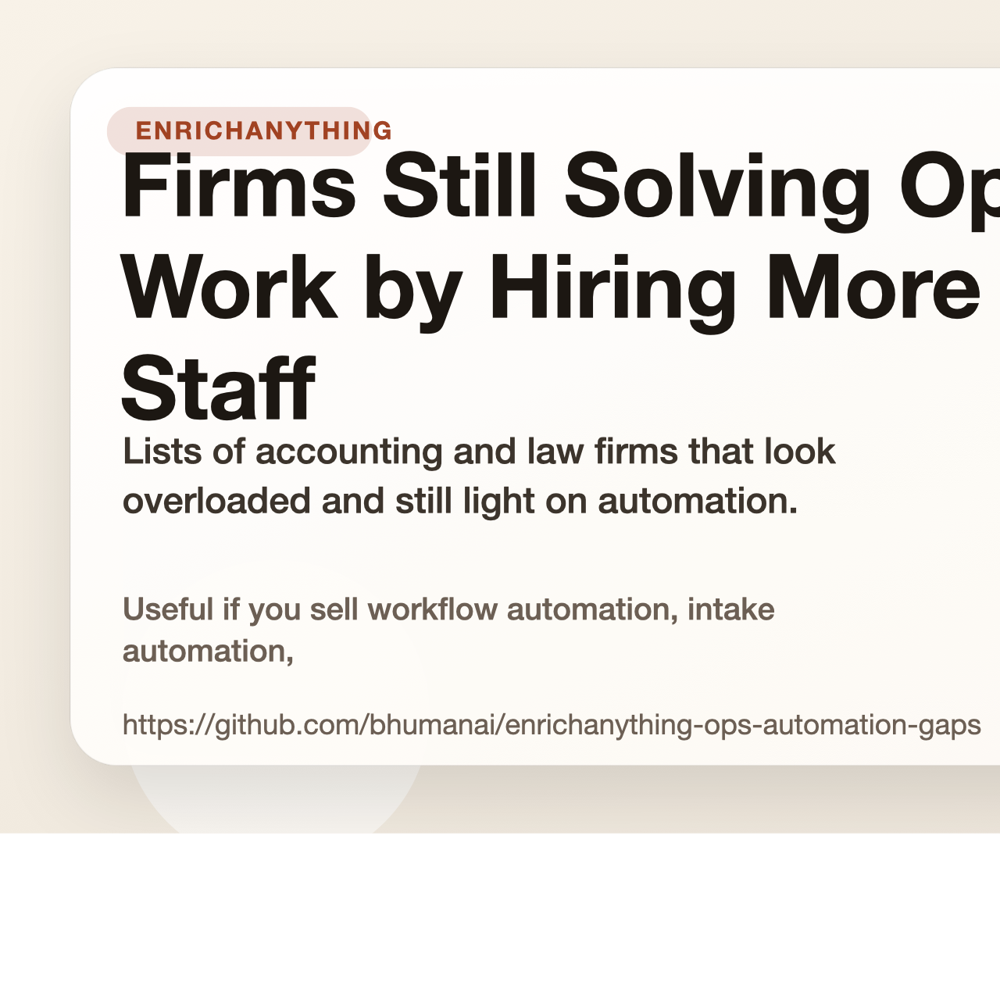

# Firms Still Solving Ops Work by Hiring More Staff

Lists of accounting and law firms that look overloaded and still light on automation.

Useful if you sell workflow automation, intake automation, or back-office ops work.

## Start here

- Fastest first click: [Accounting firms in the US hiring bookkeepers without automation tooling (10 to 100 employees)](https://www.enrichanything.com/markets/accounting-firms-us-hiring-bookkeepers-no-automation-10-100?utm_source=github&utm_medium=public_repo&utm_campaign=enrichanything-ops-automation-gaps&utm_content=market-accounting-firms-us-hiring-bookkeepers-no-automation-10-100) (live)
- Cleaner web version: [https://bhumanai.github.io/enrichanything-ops-automation-gaps/](https://bhumanai.github.io/enrichanything-ops-automation-gaps/)
- Full product: [EnrichAnything](https://www.enrichanything.com/?utm_source=github&utm_medium=public_repo&utm_campaign=enrichanything-ops-automation-gaps&utm_content=repo-home)

- Source product: https://www.enrichanything.com
- GitHub repo: https://github.com/bhumanai/enrichanything-ops-automation-gaps
- Last refresh: March 30, 2026
- Refresh command: `npm run refresh`

## Use this repo if...

- Automation agencies: Lead with labor pain, not generic efficiency. These firms already signal workflow strain by hiring around the work. Start with [Accounting firms in the US hiring bookkeepers without automation tooling (10 to 100 employees)](https://www.enrichanything.com/markets/accounting-firms-us-hiring-bookkeepers-no-automation-10-100?utm_source=github&utm_medium=public_repo&utm_campaign=enrichanything-ops-automation-gaps&utm_content=market-accounting-firms-us-hiring-bookkeepers-no-automation-10-100) (live).
- Legal intake builders: Use the law-firm list when the wedge is intake, admin load, or client handoff work that still looks too manual. Start with [Law firms in Canada hiring admin staff without automation tooling](https://www.enrichanything.com/markets/law-firms-canada-hiring-admin-no-automation?utm_source=github&utm_medium=public_repo&utm_campaign=enrichanything-ops-automation-gaps&utm_content=market-law-firms-canada-hiring-admin-no-automation) (live).
- Fractional ops consultants: Start from the firms already adding headcount, then validate where process cleanup or tooling can remove the need for more hires. Start with [Accounting firms in Canada hiring bookkeepers without automation tooling](https://www.enrichanything.com/markets/accounting-firms-canada-hiring-bookkeepers-no-automation?utm_source=github&utm_medium=public_repo&utm_campaign=enrichanything-ops-automation-gaps&utm_content=market-accounting-firms-canada-hiring-bookkeepers-no-automation) (live).

## Lists you can use now

| List | Status | Rows | Open |
| --- | --- | ---: | --- |
| [Accounting firms hiring bookkeepers without automation tooling](markets/accounting-firms-hiring-bookkeepers-no-automation/README.md) | live | 50 | [Open in EnrichAnything](https://www.enrichanything.com/markets/accounting-firms-hiring-bookkeepers-no-automation?utm_source=github&utm_medium=public_repo&utm_campaign=enrichanything-ops-automation-gaps&utm_content=market-accounting-firms-hiring-bookkeepers-no-automation) |
| [Accounting firms in Canada hiring bookkeepers without automation tooling](markets/accounting-firms-canada-hiring-bookkeepers-no-automation/README.md) | live | 34 | [Open in EnrichAnything](https://www.enrichanything.com/markets/accounting-firms-canada-hiring-bookkeepers-no-automation?utm_source=github&utm_medium=public_repo&utm_campaign=enrichanything-ops-automation-gaps&utm_content=market-accounting-firms-canada-hiring-bookkeepers-no-automation) |
| [Accounting firms in the US hiring bookkeepers without automation tooling (10 to 100 employees)](markets/accounting-firms-us-hiring-bookkeepers-no-automation-10-100/README.md) | live | 28 | [Open in EnrichAnything](https://www.enrichanything.com/markets/accounting-firms-us-hiring-bookkeepers-no-automation-10-100?utm_source=github&utm_medium=public_repo&utm_campaign=enrichanything-ops-automation-gaps&utm_content=market-accounting-firms-us-hiring-bookkeepers-no-automation-10-100) |
| [Law firms in Canada hiring admin staff without automation tooling](markets/law-firms-canada-hiring-admin-no-automation/README.md) | live | 21 | [Open in EnrichAnything](https://www.enrichanything.com/markets/law-firms-canada-hiring-admin-no-automation?utm_source=github&utm_medium=public_repo&utm_campaign=enrichanything-ops-automation-gaps&utm_content=market-law-firms-canada-hiring-admin-no-automation) |

## Notes that explain the market

| Note | Status | Rows | Open |
| --- | --- | ---: | --- |
| [Canadian accounting firms still hire around process pain before they automate it](reports/canada-accounting-automation-gap/README.md) | live | 34 | [Open in EnrichAnything](https://www.enrichanything.com/reports/canada-accounting-automation-gap?utm_source=github&utm_medium=public_repo&utm_campaign=enrichanything-ops-automation-gaps&utm_content=report-canada-accounting-automation-gap) |
| [Canadian law firms still hire around intake and admin workload before they automate it](reports/canada-law-firm-automation-gap/README.md) | live | 21 | [Open in EnrichAnything](https://www.enrichanything.com/reports/canada-law-firm-automation-gap?utm_source=github&utm_medium=public_repo&utm_campaign=enrichanything-ops-automation-gaps&utm_content=report-canada-law-firm-automation-gap) |
| [Small accounting firms still hire around process pain before they automate it](reports/accounting-automation-gap/README.md) | live | 50 | [Open in EnrichAnything](https://www.enrichanything.com/reports/accounting-automation-gap?utm_source=github&utm_medium=public_repo&utm_campaign=enrichanything-ops-automation-gaps&utm_content=report-accounting-automation-gap) |
| [US accounting firms still hire around process pain before they automate it](reports/us-accounting-automation-gap-10-100/README.md) | live | 28 | [Open in EnrichAnything](https://www.enrichanything.com/reports/us-accounting-automation-gap-10-100?utm_source=github&utm_medium=public_repo&utm_campaign=enrichanything-ops-automation-gaps&utm_content=report-us-accounting-automation-gap-10-100) |

## Need a custom cut?

Open [EnrichAnything](https://www.enrichanything.com/?utm_source=github&utm_medium=public_repo&utm_campaign=enrichanything-ops-automation-gaps&utm_content=repo-home) if you want more columns, a fresh export, or the same pattern for a different niche.
